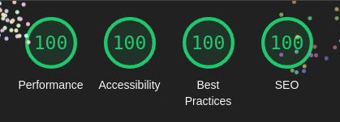

# blog-maikon-rios

> A simple blog create for fun and learn more about Next.js, React and TDD with Typescript.

## Prerequisites

- [Node.js 18.x or higher](https://nodejs.org/en/)
- [bun](https://bun.sh/)
- [Docker](https://www.docker.com/)

## Getting Started

> Before start, make sure you create a `.env` file in the root of the project and fill it with the variables in the `.env.example` file.
> use the command `bun run env:generate` to generate the `.env` file.

First setup the database:

```bash
bun run infra:up
```

Then install the dependencies:

```bash
bun install
```

Run the migrations:

```bash
bun run prisma:migrate
```

Finally, run the development server:

```bash
bun run dev
```

Open [http://localhost:3000](http://localhost:3000) with your browser to see the result.

## Tests on LightHouse


